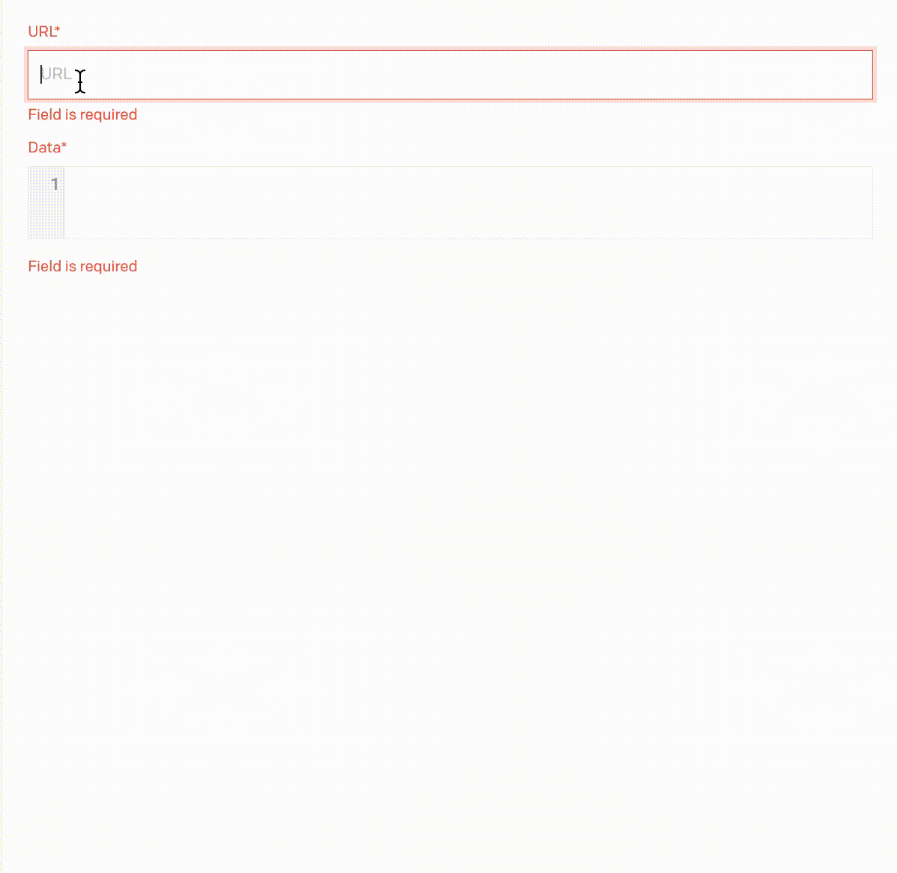

# OEmbed Plugin

**[DatoCMS plugin](https://www.datocms.com/marketplace/plugins) to get embed data for external content, using the [OEmbed](https://oembed.com/).**

<!-- todo: add a few different sources (Flickr, Codepen, etc) -->